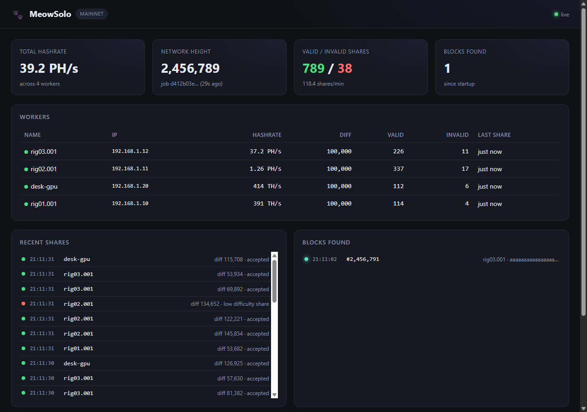

# MeowSolo

Solo-mine Meowcoin (MEWC) in three clicks. Download, run, paste your address.



Forked from [JustAResearcher/Meowcoin-Stratum](https://github.com/JustAResearcher/Meowcoin-Stratum). Same MeowPoW engine, same APEX consensus. New: setup wizard, web dashboard, single binary, no Node install.

## Download

[**Latest release →**](https://github.com/JustAResearcher/Meowcoin-Stratum/releases/latest)

| | |
|---|---|
| Windows x64 | `MeowSolo-X.Y.Z-windows-x64.zip` |
| Linux x86_64 | `MeowSolo-X.Y.Z-linux-x86_64.tar.gz` |

## Quick start

**Prerequisite:** Meowcoin Core is installed, synced, and `meowcoin.conf` contains:

```
server=1
rpcuser=meow
rpcpassword=<a-long-random-string>
```

(Restart Core after editing.)

Then:

1. Unzip and run `meowsolo.exe` (Windows) or `./meowsolo` (Linux).
2. The wizard finds your `meowcoin.conf`, asks for your M-prefix payout address, and writes `config.json`.
3. Point your GPU miner at the stratum URL it prints — e.g. `stratum+tcp://127.0.0.1:3333`.
4. Open `http://localhost:8080` for the live dashboard.

## What you get per block

Meowcoin's block reward is **5000 MEWC total**, split by consensus:

- **3000 MEWC + all transaction fees → your payout address** (the one you entered in the wizard)
- **2000 MEWC → community fund** (`MPyNGZSSZ4rbjkVJRLn3v64pMcktpEYJnU`)

The split is enforced by Meowcoin Core — same for every miner. The daemon tells the stratum the exact required outputs via `getblocktemplate`; the stratum just honors them.

> ⚠ **Important for anyone who ran v2.0.x:** the old `Coinbase.js` was hardcoded to compute the dev cut from a stale 5000-MEWC subsidy assumption, so it shortchanged the miner output to 1000 MEWC (instead of the consensus-enforced 3000). [**v2.1.0**](https://github.com/JustAResearcher/Meowcoin-Stratum/releases/tag/v2.1.0) fixes that. Upgrade.

## Mining software

Use any MeowPoW-capable GPU miner. The algorithm flag is `meowpow` — **not** `kawpow`.

**SRBMiner-MULTI** (`start.bat` next to `SRBMiner-MULTI.exe`):

```batch
@echo off
SRBMiner-MULTI.exe --algorithm meowpow --pool stratum+tcp://127.0.0.1:3333 --wallet x --password x
pause
```

**T-Rex / TeamRedMiner / NBMiner** — same flag pattern: `-a meowpow -o stratum+tcp://127.0.0.1:3333 -u x -p x`.

Wallet/username/password values are ignored by solo mining. Your payout address lives in MeowSolo's `config.json`.

If MeowSolo is on a different PC from your miner, swap `127.0.0.1` for the LAN IP MeowSolo prints at startup.

## Troubleshooting

| Console says | Fix |
|---|---|
| `Couldn't connect to Meowcoin Core at 127.0.0.1:9766` | Start Meowcoin Core; ensure `server=1` is in `meowcoin.conf`. |
| `RPC username/password rejected (401)` | Delete `config.json`, re-run, the wizard rewrites it. |
| `Invalid coinbaseAddress` | Wrong network or typo. Run `meowsolo init` and paste a fresh address from your wallet. |
| Miner connects but no shares accepted | Lower `port.diff` in `config.json` (try `10000`) and restart. |
| `Can't write block log to ... EACCES` | You launched the .exe from a write-protected folder (Program Files, a network share). Move it to your Desktop or Downloads and run again. |

When a block is found, `block_finds.xlsx` gets appended next to the binary (height, miner reward in MEWC, fees, txid, worker, nonce). The absolute path is printed at startup so you know where to look.

## Configuration

The wizard generates `config.json`. You can hand-edit any of these later:

```json
{
  "consensus": "apex",
  "coinbaseAddress": "M...",
  "port":    { "number": 3333, "diff": 100000 },
  "rpc":     { "host": "127.0.0.1", "port": 9766, "user": "...", "password": "..." },
  "dashboard": { "enabled": true, "port": 8080 }
}
```

- `port.diff` — raise it if you have heavy hashrate (rule of thumb: ~`farm_MH/s × 1.5`).
- `dashboard.enabled: false` (or `--no-dashboard`) to skip the web UI.
- `consensus: "legacy"` only for pre-APEX Meowcoin Core 3.0.6 nodes (rare).

The community-fund output (2000 MEWC to `MPyN…`) is **not** a config knob — it's set by consensus from `getblocktemplate` and applied to every block.

## CLI

```
meowsolo                  Run mining (wizard on first run)
meowsolo init             Re-run the wizard
meowsolo --testnet        Force testnet defaults in the wizard
meowsolo --no-dashboard   Skip the web UI
meowsolo --config PATH    Use a non-default config.json
meowsolo --port N         Override dashboard port (default 8080)
meowsolo --version
```

## Build from source

```bash
git clone https://github.com/JustAResearcher/Meowcoin-Stratum.git
cd Meowcoin-Stratum
npm install
node bin/meowsolo.js          # run directly
npm run build:win             # → dist/meowsolo.exe
npm run build:linux           # → dist/meowsolo (Linux x86_64)
```

Windows builds need the Visual Studio C++ workload (to compile the native MeowPoW addon). On Linux you need `build-essential` + Python.

## Credits

[JustAResearcher/Meowcoin-Stratum](https://github.com/JustAResearcher/Meowcoin-Stratum) (upstream) · [LabyrinthCore/kawpow-stratum](https://github.com/LabyrinthCore/kawpow-stratum) (original) · [MintPond](https://github.com/MintPond) libraries. MIT.
